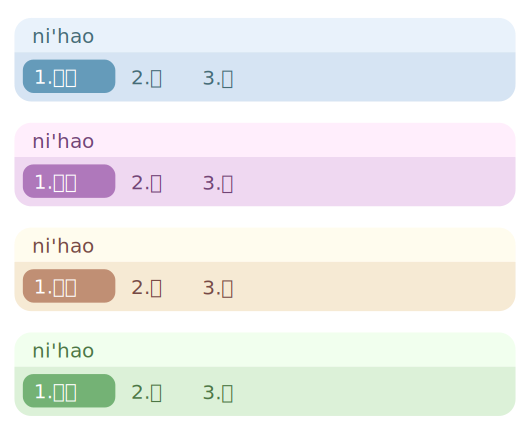

# Fcitx5 PT's cute light 主题

个人审美向的可爱主题，工作在水平候选模式：

（编辑 `~/.config/fcitx5/conf/classicui.conf` 或在 `fcitx5` 相关设置页面）

```
Vertical Candidate List=False
```

我使用的字体：[Maple Mono NF CN](https://github.com/subframe7536/maple-font) 15pt

## 预览



## 实际效果

### PT's Kagami


### PT's Konata


### PT's Minami


### PT's Misao


## 使用方法

下载本项目到本地：

```bash
git clone https://github.com/passthem/fcitx5-theme-pt-cute-light.git
```

将文件夹复制或连接至 `fcitx5` 主题文件夹：

```bash
# 方法1 复制
cd fcitx5-theme-pt-cute-light
cp ./kagami ~/.local/share/fcitx5/themes/
cp ./konata ~/.local/share/fcitx5/themes/
cp ./minami ~/.local/share/fcitx5/themes/
cp ./misao ~/.local/share/fcitx5/themes/

# 方法2 建立软链接
cd fcitx5-theme-pt-cute-light
ln -s ./kagami ~/.local/share/fcitx5/themes/
ln -s ./konata ~/.local/share/fcitx5/themes/
ln -s ./minami ~/.local/share/fcitx5/themes/
ln -s ./misao ~/.local/share/fcitx5/themes/
```
